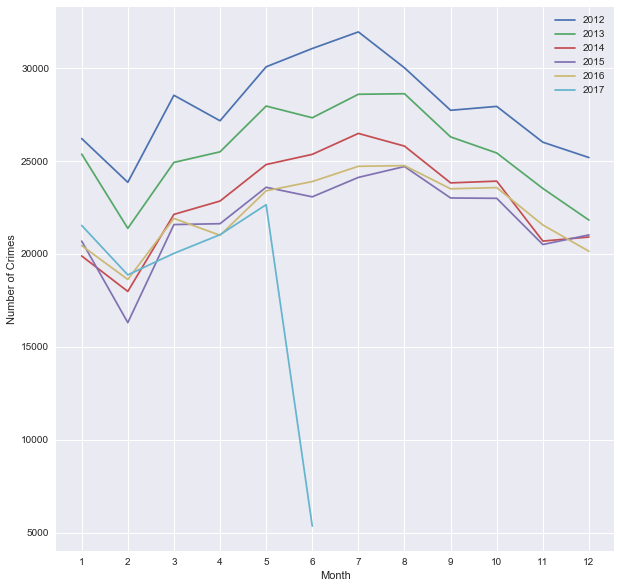
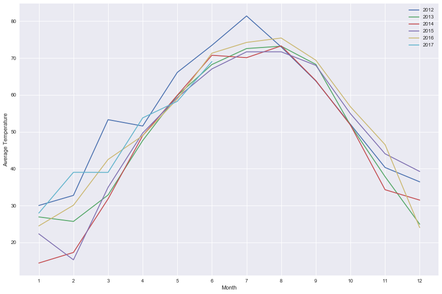
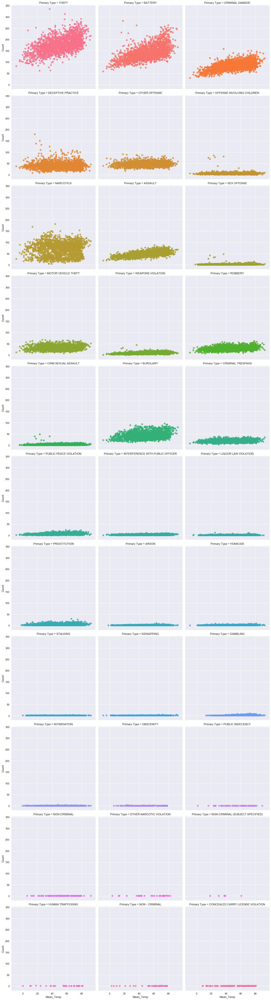
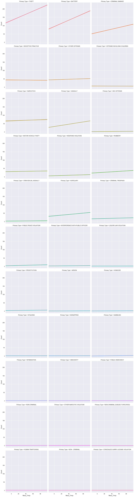

# 
Does a hot summer mean more crime?

## 
Introduction

The purpose of this analysis is to parse and understand the relationship between temperature and crime in Chicago. The Tribune referred to historical data from the City of Chicago and Midwestern Regional Climate Center to identify when crimes peak? and which types of crimes tend to occur more frequently as temperature rises?

## 
 Methodology

### Data Collection:

The Tribune collected data on all crimes in Chicago between January 1st, 2012 to June 7th, 2017 from [City of Chicago Data Portal](https://data.cityofchicago.org/Public-Safety/Crimes-2001-to-present/ijzp-q8t2). Average daily temperature data was also collected from the [Midwestern Regional Climate Center](http://mrcc.isws.illinois.edu/) for the same time range. You can access the crime and average daily temperature data the Tribune has collected in [here](https://github.com/mallaham/tribune-projects/tree/master/Crime-Weather-Analysis/crimeData) and [here](https://github.com/mallaham/tribune-projects/blob/master/Crime-Weather-Analysis/climate_Data_Jan_1_2012_up_to_Jun_7_2017.csv).

### Data Processing:

In our first round of exploratory analysis, we wanted to see if crime and temperature have similar trends (or pattern) over the span of the past 5 years.
 
**Note: the drop in the crime chart in 2017 is due to missing data at the time of analysis**

Crime in the past 5 years            |  Weather in the past 5 years
:-------------------------:|:-------------------------:
  |  

In general, crime rates tend to peak during the summer. The Tribune calculated the average number of crime incidents during summer (from June to August) for each year since 2012, and found it to be the deadliest of all years. 2012, has also been identified to be the warmest year with a total of 28 days having average daily temperature of 80 degrees and higher. 
The table below shows the average number of crime incidents in Chicago by year during the summer:

|Year| Average Number of Crimes During Summer|
|----|:--------------------------------------|
|2012|  31007.666667|
|2013|  28182.333333|
|2014|  25884.333333|
|2015|  23967.666667|
|2016|  24457.333333|
|2017|  5358.000000|

The Tribune also looked at the general trend of crime in Chicago since January 1st, 2012. The table below provides a summary of the 5 most frequent crimes in Chicago and the total number of incidents associated with each crime type:

| Crime | Number of Incidents|
|-------|:------------------:|
| Theft | 350,000|
| Shootings & Battery | +250,000|
| Criminal Damage | +150,000|
| Narcotics | +100,000|
| Assault | < 100,000|

As part of data agregation, the Tribune restructued the data so that each row represents a single crime incident. Each crime incident has the following attributes: 
- When did an incident occur? (Date, Year, Month, and Day)
- Average daily temperature of the day when an incident has occured
- Type of crime (labeled as Primary Type)
- Count (number of incidients of each crime type per day) 

In order to verify our assumption regarding the relationship between crime and temperature, the Tribune scatteplot (chart on the left) each crime type to visualize the trend in crime as temperature increases.

The Tribune then fitted a linear regression line to determine which types of crimes get effected the most by the rise of temperature (chart on the right). The Tribune assessed the regression analysis results by checking which types of crimes have the steepest slopes. The results show that **theft**, **battery**, **criminal damage**, **narcotics**, **assault**, **robbery**,and **burglary** tend to have a non-flat slope.

Scatterplot of each crime type|  Best line fit for each crime type
:-------------------------:|:-------------------------:
  |  
 

For further details about the analysis, check out this [notebook](https://github.com/mallaham/tribune-projects/blob/master/Crime-Weather-Analysis/Crime_Weather_Report-Analysis.ipynb)

By far, the analysis shows, there is a positive linear relationship between temperature and crime. In general, as the temperature increases the number of crimes tend to increase as well. However, the magnitude (or strength) of this relationship varies across years and types of crimes. 

Since crimes differ in their rate of occurance, this means that each crime could possibly have its own mean that varies over time. In order to account for these variations, the Tribune built a Multi-Level Model (MLM) that focuses on assault, battery, homicide, burglary, criminal damage, motor vehicle theft, narcotics and theft. The Tribune chose to focus on those crime types based on the linear regression analysis that was conducted early on. In the MLM model, we accounted for the variation in the number of crimes in each year and the total number of incidents representing each crime type. The results from this analysis show that for every 10 degree increase in temperature there are:

- 9 thefts
- 9 battery incdients
- 5 criminal damage incidents
- 3 assault incidents
- 2 burgulary incidents
- 1 narcotics incident 

The Tribune later verified wether the rise in temperature has any effect on homicides. The results show that temperature fails to predict the number of homicides that could occur as temperature increases. This is partially due to the inconsistent pattern that homocides follow during the past 5 years.

Below shows a summary of the MLM results:

|Effects                                    |Estimate    |std.err   |t-value|
|-------------------------------------------|:----------:|:--------:|:-----:|
|Mean_Temp:Primary.TypeASSAULT               |0.335653   |0.020328   |16.51|
|Mean_Temp:Primary.TypeBATTERY               |0.949677   |0.020328   |46.72|
|Mean_Temp:Primary.TypeBURGLARY              |0.195130   |0.020328   | 9.60|
|Mean_Temp:Primary.TypeCRIMINAL DAMAGE       |0.495823   |0.020328   |24.39|
|Mean_Temp:Primary.TypeMOTOR VEHICLE THEFT   |0.028752   |0.020328   | 1.41|
|Mean_Temp:Primary.TypeNARCOTICS             |0.070149   |0.020328   | 3.45|
|Mean_Temp:Primary.TypeTHEFT                 |0.932344   |0.020328   |45.87|
|Mean_Temp:Primary.TypeHOMICIDE              |0.0003812  |0.0242559  |0.02|

For further details about the statistical analysis, please follow this [link](https://github.com/mallaham/tribune-projects/tree/master/Crime-Weather-Analysis/Mixed_Model_Analysis)

In conclusion, based on historic crime and temperature data, the rise of temperature tend to affect crime types in Chicago differently. Thus, causing some crime types, such as thefts and battery, to increase much more than others.
